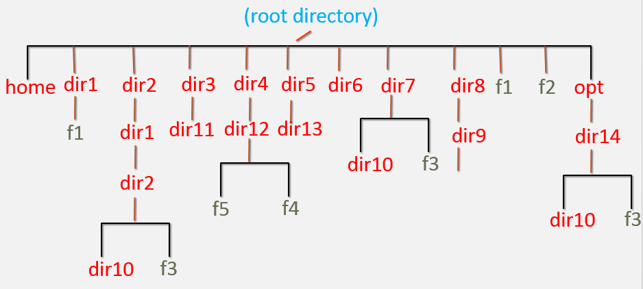

# DevOps Linux Server Setup Assignment

This README provides a step-by-step guide to completing the Linux-based server setup assignment on AWS EC2. The task involves creating users, groups, directories, managing file systems, and performing operations in a Linux environment to simulate real-world DevOps tasks.

## Requirements

- AWS Cloud Account
- Linux-based EC2 Instance
- Basic Linux command-line knowledge

## Steps

### 1. **Login to AWS and Create EC2 Instance**
   - Log in to your AWS account and launch a Linux-based EC2 instance. 
   - Connect to the instance as the super user.

### 2. **Create Users and Groups**
   - **Create users**: `user1`, `user2`, `user3`
   - **Create Groups**: `devops`, `aws`
   - **Modify User Groups**:
     - Change the primary group of `user2` and `user3` to `devops`.
     - Add `aws` group as a secondary group to `user1`.

### 3. **File and Directory Structure**
   - **Create the file and directory structure** as shown in the diagram provided (not included here).
   - Change the group of `/dir1`, `/dir7/dir10`, `/f2` to the `devops` group.
   - Change ownership of `/dir1`, `/dir7/dir10`, `/f2` to `user1`.

### 4. **Login as `user1`**
   - **Create additional users**: `user4`, `user5`
   - **Create new groups**: `app`, `database`

### 5. **Login as `user4`**
   - Create directory `/dir6/dir4`
   - Create file `/f3`
   - **Move files**:
     - Move the file `/dir1/f1` to `/dir2/dir1/dir2`
     - Rename `/f2` to `/f4`

### 6. **Login as `user1`**
   - Create directory `/home/user2/dir1`
   - Change to `/dir2/dir1/dir2/dir10` and create file `/opt/dir14/dir10/f1` using relative path.
   - Move the file `/opt/dir14/dir10/f1` to user1's home directory.
   - Delete the directory `/dir4` recursively.
   - Delete all child files and directories under `/opt/dir14` using a single command.
   - Write "Linux assessment for a DevOps Engineer!! Learn with Fun!!" to the `/f3` file and save it.

### 7. **Login as `user2`**
   - Create file `/dir1/f2`
   - Delete `/dir6`
   - Delete `/dir8`
   - **Edit file `/f3`**:
     - Replace the text "DevOps" with "devops" (without using a text editor).
     - Use `vi` editor to copy line 1 and paste it 10 times in the file `/f3`.
     - Search for the pattern "Engineer" and replace it with "engineer" using a single command.
   - Delete `/f3`.

### 8. **Login as Root User**
   - Search for the file name `f3` on the server and list all absolute paths where it is found.
   - Show the count of the number of files in the root directory `/`.
   - Print the last line of the file `/etc/passwd`.

### 9. **Create and Attach EBS Volume**
   - Login to AWS and create a 5GB EBS volume in the same Availability Zone as the EC2 instance.
   - Attach the EBS volume to the EC2 instance.

### 10. **Root User Tasks for EBS Volume**
   - **Create File System** on the newly attached EBS volume.
   - **Mount the File System** to the `/data` directory.
   - Verify file system utilization using the `df -h` command. Ensure `/data` is listed.
   - Create a file `f1` in the `/data` file system.

### 11. **Login as `user5`**
   - Delete the following directories:
     - `/dir1`
     - `/dir2`
     - `/dir3`
     - `/dir5`
     - `/dir7`
   - Delete files `/f1` and `/f4`.
   - Delete `/opt/dir14`.

### 12. **Root User Cleanup Tasks**
   - Delete users: `user1`, `user2`, `user3`, `user4`, `user5`.
   - Delete groups: `app`, `aws`, `database`, `devops`.
   - Delete the home directories of all users if they still exist.
   - Unmount the `/data` file system.
   - Delete the `/data` directory.

### 13. **EBS Cleanup**
   - Login to AWS, detach the EBS volume from the EC2 instance, and delete the volume.
   - Terminate the EC2 instance.

## Conclusion
 repeat