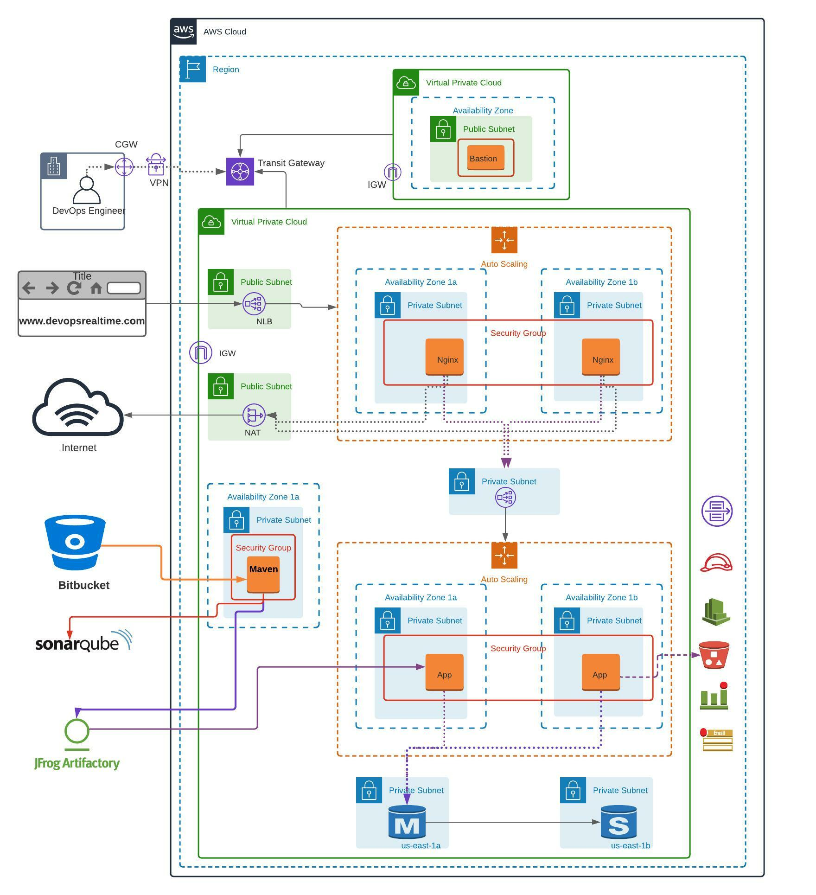

# Scalable, Highly Available, and Secured Java Application Deployment on 3-Tier Architecture

## Goal

The goal of this project is to deploy a scalable, highly available, and secure Java application on a 3-tier architecture and provide application access to end users from the public internet.

## Pre-Requisites

Before starting, ensure you have the following:

- **AWS Free Tier account**: Create an AWS account.
- **GitHub account**: Create a GitHub account and create a repository to store your Java source code.
- **Java Source Code Migration**: Migrate your Java source code to your GitHub repository.
- **SonarCloud account**: Create an account in [SonarCloud](https://sonarcloud.io/).
- **JFrog Cloud account**: Create an account in [JFrog Cloud](https://jfrog.com/).

## Pre-Deployment

### 1. Create Global AMI

- Create and configure **Global AMI** to be used for subsequent AMIs for Nginx, Tomcat, and Maven builds.
  
### 2. AWS CLI & CloudWatch Agent

- Install and configure **AWS CLI**.
- Install and configure **CloudWatch agent**.
  
### 3. Install AWS SSM Agent

- Install **AWS SSM agent** to manage EC2 instances via Session Manager.
  
### 4. Golden AMIs Creation

- **Golden AMI for Nginx application**:
  - Install **Nginx** and configure as required.
  - Push custom memory metrics to **CloudWatch**.
  
- **Golden AMI for Apache Tomcat application**:
  - Install **Apache Tomcat** and configure it as a **Systemd service**.
  - Install **JDK 11** and push custom memory metrics to **CloudWatch**.
  
- **Golden AMI for Apache Maven Build Tool**:
  - Install **Apache Maven**, **Git**, and **JDK 11**.
  - Update Maven Home to the system PATH environment variable.

## VPC Deployment

### 1. Build VPC Network

- **VPC Network Setup**:
  - Build VPC network `192.168.0.0/16` for Bastion Host deployment.
  - Build VPC network `172.32.0.0/16` for deploying highly available and auto-scalable application servers.

### 2. Create Network Resources

- **NAT Gateway**: In Public Subnet to route default traffic for outbound internet connection.
- **Transit Gateway**: For private communication between both VPCs.
- **Internet Gateway**: For inbound and outbound traffic to/from public subnets.

### 3. Bastion Host

- Deploy **Bastion Host** in the public subnet with **EIP** associated.
- Create **Security Group** allowing **port 22** from the public internet.

## Maven (Build)

1. **Create EC2 Instance** using Maven Golden AMI.
2. **Clone GitHub repository** to **VSCode** and update `pom.xml` with Sonar and JFrog deployment details.
3. **Update settings.xml** with JFrog credentials and repository details.
4. **Update application.properties** file with JDBC connection string for MySQL.
5. Push the code changes to a feature branch of the GitHub repository.
6. Raise a **Pull Request** to approve and merge changes into the master branch.
7. Login to EC2 instance, clone the GitHub repository, and build the source code using Maven arguments `"-s settings.xml"`.
8. Integrate **Sonar Cloud** and generate an analysis dashboard with the default **Quality Gate** profile.

## 3-Tier Architecture Deployment

### 1. Database (RDS)

- Deploy a **Multi-AZ MySQL RDS instance** into private subnets.
- Create **Security Group** allowing **port 3306** from application instances and Bastion Host.

### 2. Tomcat (Backend)

- **Network Load Balancer (NLB)**: Create a private-facing NLB with a target group.
- **Launch Configuration**:
  - Use **Tomcat Golden AMI**.
  - User Data to deploy `.war` artifact from JFrog into the `webapps` folder.
- **Security Group**: Allow **Port 22** from Bastion Host and **Port 8080** from private NLB.
- Create an **Auto Scaling Group** for Tomcat servers.

### 3. Nginx (Frontend)

- **Public-facing NLB**: Create a public-facing NLB with a target group.
- **Launch Configuration**:
  - Use **Nginx Golden AMI**.
  - User Data to update **proxy_pass** rules in `nginx.conf` and reload Nginx.
- **Security Group**: Allow **Port 22** from Bastion Host and **Port 80** from Public NLB.
- Create an **Auto Scaling Group** for Nginx servers.

## Application Deployment

1. **Artifact Deployment**: Handled by the **User Data script** during the EC2 instance launch process.
2. **Database Setup**:
   - Login to MySQL database from the application server using MySQL CLI client.
   - Create a database and table schema to store user login data (instructions available in the GitHub repository).
  
## Post-Deployment

### 1. Log Rotation and S3 Integration

- Configure **Cronjob** to push Tomcat application log data to an **S3 bucket** and rotate the log data after it is pushed.

### 2. CloudWatch Alarms

- Set up **CloudWatch alarms** to send an email notification when database connections exceed a threshold of **100**.

## Validation

- **Administrator Validation**:
  - Verify that you can login to EC2 instances via **Session Manager** and **Bastion Host**.
  
- **End-User Validation**:
  - Verify that the application is accessible from the public internet via a browser.

---

## Conclusion

By completing this project, you will have successfully deployed a scalable, highly available, and secure 3-tier Java application architecture on AWS, leveraging AWS services like VPC, RDS, EC2, and NLBs. You will also gain hands-on experience in managing infrastructure with AWS and automating application deployments using Maven, SonarCloud, and JFrog.

Good luck with your deployment!
